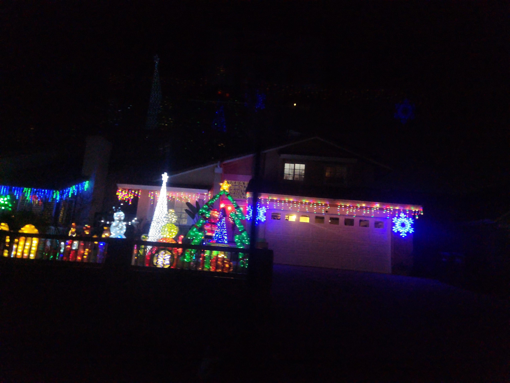
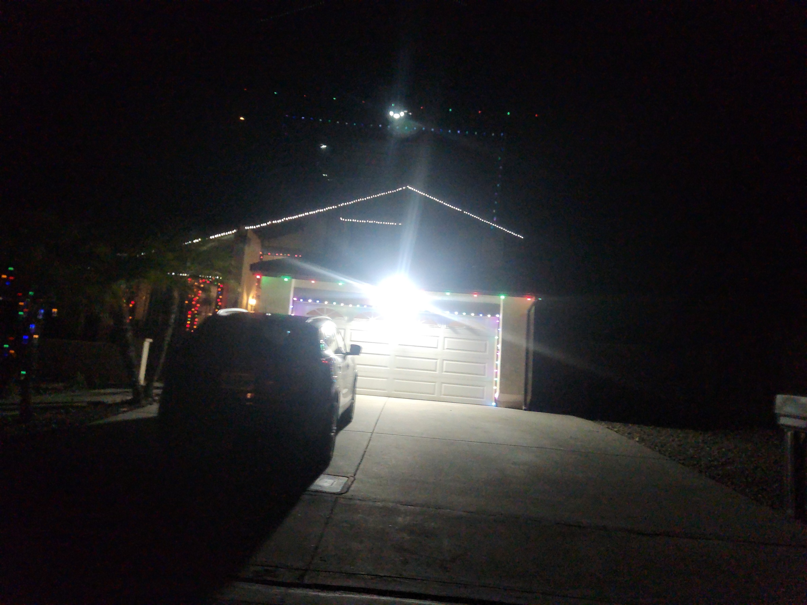
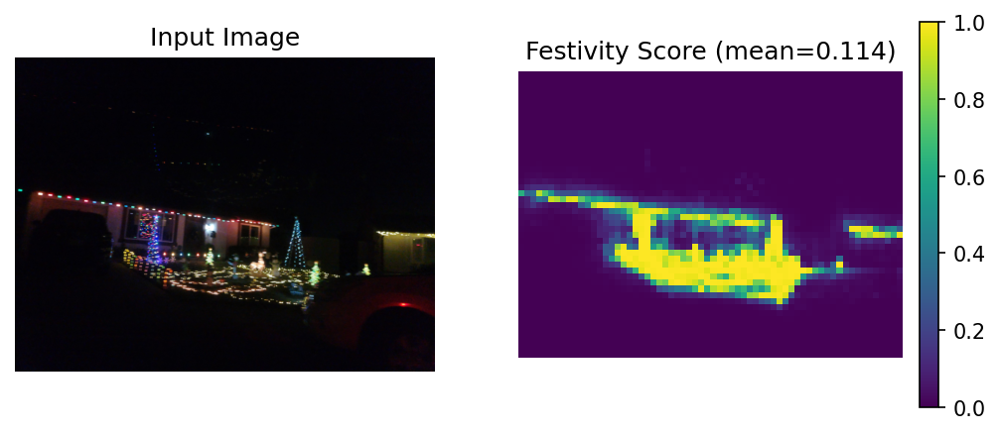
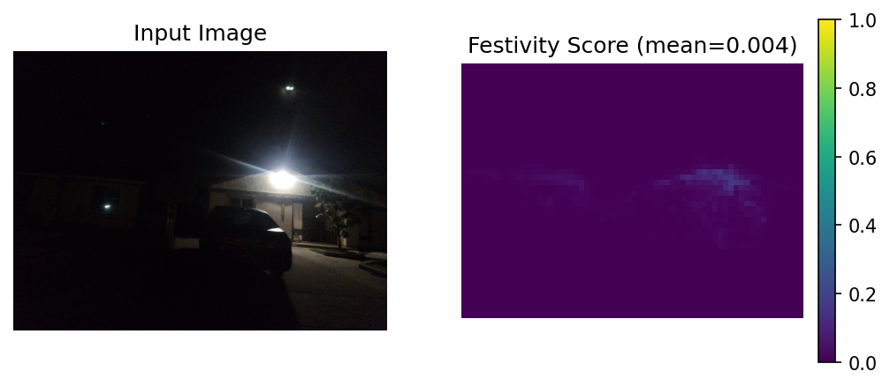
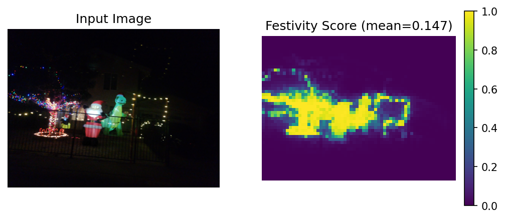
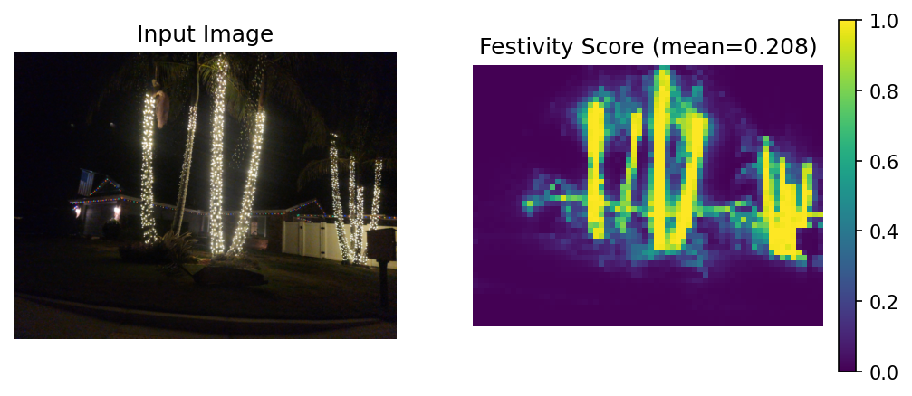

# Festivity Mapping with DINOv3 🎄🦖

Goal - given an image taken from the street at night, possibly containing a house, possibly decorated with festive lights, provide a "festivity measure" in order to sort the most festive images from the least.

Then take this model, drive around the neighbourhood continuously taking images, and automatically detect and rank the most festive houses. Perhaps produce a map of the most festive areas in the neighbourhood 📍🎅.

    
    

Which house is more festive?

Ask [Dino](https://ai.meta.com/dinov3/)! 🦖🦖🦖

## Previous approach (2024): CLIP

Previously I used [CLIP](https://openai.com/index/clip/) as a zero-shot classifier to derive per-image class probabilities for "festively lit house at night" vs "house at night". Then I used the festive class probability as the output metric.

This worked OK to detect festive houses, but was not great at quantifying just how festive a display is compared to another.

<figure>
  
  <figcaption>A selection of festively decorated houses, ranked in terms of festivity using clip (top-left = most festive). Clip has done a good job of detecting the festive houses (note most images in the dataset do not contain decorated houses). However the ranking is questionable - some lower effort displays are ranked above more impressive ones.</figcaption>
</figure>

Now it is 2025, dinov3 is out, I have a bit of time. Here I look at using dino patch embeddings to produce a dense festivity map, which I can aggregate over the image to more accurately quantify festivity.

## New approach: DINOv3 segmentation

Basically, following the notebook from their repo [foreground_segmentation.ipynb](https://github.com/facebookresearch/dinov3/blob/main/notebooks/foreground_segmentation.ipynb) but modified to run on my own dataset. This takes images and associated foreground masks, and trains a linear classifier to distinguish foreground from dino patch embeddings. For my application the "foreground" class is "festive pixels", and an overall festivity score is produced by taking mean festivity across the whole image.

A small number of labelled images are required. I started with a couple, then added more ad-hoc as I encountered interesting failure cases in the output maps. At time of writing I have 15 labelled images for training, and I'm quite excited by the results.

I used [GIMP](https://www.gimp.org/) to draw the masks (labelling instructions [here](./labelling.md)). Most of the code is co-pilot generated, based on the linked notebook from the dino repo.

Train and test code is in [train_from_labelled_dataset.py](./train_from_labelled_dataset.py).

## Workflow / Usage

A copilot-generated CLI has been built to handle processing of images to create maps. See [`usage.md`](doc/usage.md) for instructions.

## Results

Here's what the dense output festivity map looks like for a few cases:

---

<figure>
  
  <figcaption>A festive scene, along with festivity map.</figcaption>
</figure>

---

<figure>
  
  <figcaption>Street lights are not festive.</figcaption>
</figure>

---

<figure>
  
  <figcaption>Security lights are not festive.</figcaption>
</figure>

---

<figure>
  
  <figcaption>Inflatable dinosaurs are festive with probability <code>p=1.0</code></figcaption>
</figure>

---

<figure>
  
  <figcaption>The most festive image in the dataset, by mean per-pixel festivity.</figcaption>
</figure>

---

<figure>
  
  <figcaption>A selection of images sorted by festivity (top left = most festive). In contrast to CLIP, the rankings are much more consistent/appropriate.</figcaption>
</figure>

---

Overall results are very promising, but with some potential areas to explore:
* Close-up displays take up more pixels than those further away, so achieve higher festivity scores. Consider re-weighting with depth-anything estimates.
* Should a bunch of decorated palm trees really win the "most festive" prize? How can we capture aspects of creativity, novelty, ability to inspire awe, etc? Probably not with a per-pixel metric - try a VLM?

## Failed approach: dino.txt

I previously attempted a text-based approach more similar to what was done with CLIP - to compare patch embeddings with text embeddings to determine festive-ness. The idea was to produce the festivity measure zero-shot without labelling any data.

`dino.txt` is provided for this use case:
* [readme-ov-file#pretrained-heads---zero-shot-tasks-with-dinotxt](https://github.com/facebookresearch/dinov3/tree/main?tab=readme-ov-file#pretrained-heads---zero-shot-tasks-with-dinotxt)
* [dinotxt_inference.ipynb](https://github.com/facebookresearch/dinov3/blob/main/notebooks/dinotxt_inference.ipynb)

AFAIU, `dino.txt` adds a text encoder as well as some additional layers on the dino backbone, in order to project image and text features to the same embedding space, where they can be compared in the same way as CLIP embeddings.

Unfortunately this didn't work on my first attempt, so, limited on time, I decided to try the label based approach above. 

<figure>
  
  <figcaption>Input image and similarity map comparing patch embeddings to text embeddings for prompt "festive house decoration". Output doesn't appear at all correlated with festivity.</figcaption>
</figure>

I expect this is pure user-error, I just don't have time to debug 🤷.

Script is saved under [doc/dino_txt_inference.py](doc/dino_txt_inference.py) for future debugging.

## Other quick failed experiments

#### Can [SAM 3](https://ai.meta.com/sam3/) segment out the festive parts of the image?

<figure>
  
  <figcaption>Prompt: "Brightly lit holiday decoration"</figcaption>
</figure>

I didn't like how it segmented out the whole tree, this would lead to over-estimation of festive-ness due to the large area segmented. It makes sense for SAM to behave this way - it's probably used to identifying whole objects. 

It also misses the string lights to the right.

I tried a few prompts and was unsatisfied for this task.

#### Can [Nano Banana Pro](https://blog.google/technology/ai/nano-banana-pro/) label my images for me?

Similar approach to above, but I'm thinking just to produce the labelled data (not sure how much API would cost for 10,000s of images).

<figure>
  
  <figcaption>Trying to get nano banana to do segmentation.</figcaption>
</figure>

Result - segmented almost the whole house. Perhaps this is the wrong VLM for the job.

## Promising quick experiments

#### Can [DA3](https://depth-anything-3.github.io/) be used to weight features by distance?

The idea is that a festive display close-up should not score higher than one far away. Should be simple enough to reweight pixels based on depth(?)

<figure>
  
  <figcaption>Metric depth estimate from single image</figcaption>
</figure>

Result - model predicts garage door 26m away - seems reasonable. Probably worth trying the reweighting idea if any close up displays are ranking too high.

#### Can [Gemini 3](https://aistudio.google.com/models/gemini-3) produce better ratings than counting festive pixels?

<figure>
  
  <figcaption>Gemini rates a display</figcaption>
</figure>

Gemini rates the display 3.8/10, and provides a robust analysis, along with an assesment rubric:

<figure>
  
  <figcaption>Gemini-generated rubric for assessing lighting displays</figcaption>
</figure>

Perhaps this would be the most robust way to quantify festive-ness. However would have to look at API costs - I expect a full map dataset to be on the order of ~10k images.

## Next steps

* Reweight based on depth-anything depths
* Project onto map to produce festivity maps for the neighbourhood 
* Bigger dataset

